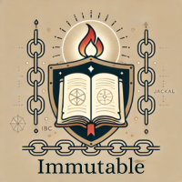

📜 Immutable: Preserving Truth & Prophecy

A censorship-resistant archive safeguarding martyrs’ testimonies, prophecy fulfillment, and often forgotten historical records using IBC, IPFS, Jackal, Sentinel DVPN, and decentralized technologies to ensure truth remains immutable for generations.

See [CONTRIBUTING.md](CONTRIBUTING.md) for ways to contribute

🚀 Freely given, immutable, and open-source—so truth may endure for all time.

🌍 Recovering Suppressed Knowledge & Forgotten History

Throughout time, historical truths, ancient knowledge, and prophetic insights have been lost, distorted, or censored due to persecution, political influence, and intentional suppression.

💡 Immutable is dedicated to rediscovering these truths—faster, more efficiently, and without censorship—ensuring that knowledge remains freely available to all.

🔹 Unveiling prophetic fulfillment

🔹 Analyzing Bible translations & their doctrinal impact

🔹 Unconventional Science

🔹 Restoring lost historical records

🔹 Understanding the role of political and religious power in shaping knowledge

🔹 Preserving linguistic integrity and original meanings of key texts

📚 Key Historical References

[The King James Bible, 1611](https://bafybeigjaa6mkofcjbr3bk6x5a5qx7c42pbig4ahmqoxp6hz7upqupgzg4.ipfs.w3s.link/The%20Holy%20Bible%20from%201611%20(KJV).pdf)

[The Geneva Bible, 1599](https://bafybeif3vahxl7qepgxwiuym4yx4fgn3nwimfqhpb5jaqsts4ydtfp4lny.ipfs.w3s.link/GenevaBible.pdf)

The History of the Christian Church (Philip Schaff)

[1.	0-100 AD – Early Church History](https://bafybeiekpl6nqwo5kz5k4qmgwo5f3e4ilrd3vkmecjx6ajjmaddr2ues6q.ipfs.w3s.link/History-Of-The-Christian-Church-01.pdf)

[2.	100-325 AD – Christianity under Persecution & Early Councils](https://bafybeien7jecrd3kenxxbvkjmm4op3vcpef3arspb7rtigzy7es72thzea.ipfs.w3s.link/History-Of-The-Christian-Church-02.pdf)

[3.	311-600 AD – Constantine, Church-State Alliance](https://bafybeifybhwroffbk4zemaodqow63ovgg4wpcx26kqjldnkrgwnxzqvgfe.ipfs.w3s.link/History-Of-The-Christian-Church-03.pdf)

[4.	590-1073 AD – Medieval Christianity](https://bafybeibsmpi5tsv6x5qpvqlc7kxltnggnhocn473fpnfdok3xkwziy4h2q.ipfs.w3s.link/History-Of-The-Christian-Church-04.pdf)

[5.	1049-1294 AD – The Middle Ages, Crusades, Papal Power](https://bafybeiayp3mee6y523jix5xjvmqd75kyiuraz2mptyy7ayseay754gwkd4.ipfs.w3s.link/History-Of-The-Christian-Church-05.pdf)

[6.	1294-1517 AD – Late Middle Ages & Early Dissenters](https://bafybeigstzwkc3ben7bumggrj2orq6jjb4gnaqfwxfcxjo7t3ojqu6kpuy.ipfs.w3s.link/History-Of-The-Christian-Church-06.pdf)

[7.	Modern Christianity – The German Reformation](https://bafybeiccepga3pk3vyhwtq2ws7qccjgihmhcpc4xlxq56w27gxeuuuu2jy.ipfs.w3s.link/History-Of-The-Christian-Church-07.pdf)

[8.	Modern Christianity – The Swiss Reformation](https://bafybeicxrgd7gnv2pbcbhmn4cuonewahlbbsbgrsnriswhssidyj4k6xii.ipfs.w3s.link/History-Of-The-Christian-Church-08.pdf)

📖 Bible Translation Studies
	   
•	[The Bible and Bible Translations](https://bafybeibpm4rsxhlag73o7gpkmbbhwwjdgnrklli3lqajj4hwoekaz365im.ipfs.w3s.link/The-Bible-and-Bible-Translations.pdf)

📚 The Gospel in the Torah
    
•	[The Gospel in Creation](https://bafybeigjx3bbbuslsqrjg7pxelbprcsozh6vtyuaztwnti4oscqcmqh6hq.ipfs.w3s.link/The-Gospel-In-Creation.pdf)

🔥 The Reformation & Counter-Reformation
	   
•	[History of the Reformation of the 16th Century](https://bafybeigfcon7n4hgcem2e72uuzshesq2lroqz22fqnzhcg5yapxxs7moge.ipfs.w3s.link/History-Of-The-Reformation.pdf)

🔹 Many Alliances in the 20th century...

• [The Vatican Moscow Washington Alliance](https://bafybeievqghvnqsdfu4aqmzxkt7a6soacrk7bke2zgckkoxwtzs3ghovxm.ipfs.w3s.link/the-vatican-moscow-washington-alliance-avro-manhattan.pdf)

🔹 Reasons for the Horrors should not be forgotten..

• [IBM & The Holocaust](https://bafybeibfnhwgvuuz3gcvkkj2uqz7khrgi63h3uh55c3jbvcaxfra3epddy.ipfs.w3s.link/IBM%20and%20The%20Holocaust.pdf)

🌍 Behind the scenes...two worlds between..one above and one beneath, the NWO bites its teeth

• [Be Wise as Serpents](https://bafybeih3k2ophkmquswy25uiilpyr5shmovfckbtuwtpbb2tthnwkidz6e.ipfs.w3s.link/Be%20Wise%20as%20Serpents.pdf)

• [OPERATION VAMPIRE KILLER, 2000](https://bafybeiecwrsldzs2r5nxmwsgb74fdam5oui5eduj4uzewfm42g3nqk2vla.ipfs.w3s.link/Operation%20Vampire%20Killer%202000%20Police%20Against%20the%20New%20World%20Order.pdf)

• [FEMA, The Secret Government](https://bafybeibyqbevcgprtcnxm4zm5an7lp4tssvlvkrofdxyeb7gvhphk4ykby.ipfs.w3s.link/FEMA%20-%20The%20Secret%20Government.pdf)

• [PAWNS in the GAME, by William Guy Carr](https://bafybeidnymswczunn5ukb2keoznwg4wu3a37gweki7k4ngg7gvxel73gpq.ipfs.w3s.link/pawnsinthegame.pdf)

• TBC

🔬 The Science of Creation vs Evolution 
 
"Canst thou bind the sweet influences of Pleiades, or loose the bands of Orion? Job 38:31"

• [Genesis Conflict, By Walter Veith](https://bafybeic452abuvu52hc57m7o2iyz5fnecda23mjvb4rckkpss5uqerjivm.ipfs.w3s.link/Genesis-Conflict.pdf)

Jesus told his disciples: "BE WISE AS SERPENTS HARMLESS AS DOVES"

🔧 Builders of the Present, Preservers of the Past

Immutable is a refuge for those who know that truth matters and that censorship is not wisdom. This is not a product. It’s not a pitch. It’s a call to purpose. To preserve what should not be forgotten—and to build what can never be erased.

Blockchain Architects & Interchain Visionaries

• - Builders of censorship-resistant infrastructure

• - Developers fluent in modular tools (e.g., Secret Network, IBC, Jackal, Akash, Cosmos)

• - Engineers of the new decentralized record

"To everything there is a season... a time to build up, and a time to gather stones together." – Ecclesiastes 3:1-5

License: GNU GPL v3 — to ensure all contributions remain free, transparent, interoperable, open source.

Idea-Burners & Learners in Code

• - You may not have all the syntax—but you’ve got the spark

• - You're here to grow and contribute through action, not just theory

• - You understand that freedom of memory is as sacred as freedom of speech

"The entrance of thy words giveth light; it giveth understanding unto the simple." – Psalm 119:130

Mathematicians, Ethicists & Certified Hackers

• - You believe that the guardianship of truth must include digital defense

• - You care about data integrity, cryptographic transparency, and reputation-based systems

• - You honor ethical disruption in service of protecting the unspoken

Artists, Designers, & Poets of Wireframes

• - You visualize experiences before they’re rendered

• - You sketch the unseen patterns of data and doctrine alike

• - You may not know how to ship a container—but you know how to carry the vision

"The proof of the elapsisity of time is written not in code, but in the silence that follows its misuse." – Immutable, community note

Keepers of Memory & History

• - Scholars, theologians, reformation researchers

• - Truth-seekers who have uncovered forgotten records

• - Those who preserve texts not for profit, but for posterity

"Truth shall spring out of the earth; and righteousness shall look down from heaven." – Psalm 85:11

License: Historical and theological works are protected under the Creative Commons BY-NC-SA 4.0, ensuring their availability for education, reflection, and revelation— but never distortion or profiteering.

Why It All Matters

"The thing that hath been, it is that which shall be; and that which is done is that which shall be done: and there is no new thing under the sun. Is there any thing whereof it may be said, See, this is new? it hath been already of old time, which was before us. There is no remembrance of former things; neither shall there be any remembrance of things that are to come with those that shall come after." – Ecclesiastes 1:9–11, KJV

This is why we build. This is why we archive, why we decentralize, why we preserve.

We are not fighting to be first—we are fighting to remember. To keep what was nearly erased alive for the ones who are yet to come.

"Did these documents appear in the libraries of the City of London, in monasteries around the world, or in our own Library of Congress before or after the ‘truth’ was established—with no strong counter-thesis?"

Immutable exists because truth deserves a witness—in history, in code, in design, and in spirit.

📜 Dual Licensing  

This project is dual-licensed to protect both the historical records and the open-source blockchain infrastructure:  

- 📖 Historical Content (Bible texts, historical records, prophecy records, martyrs' testimonies, typology studies)  
  - Licensed under [Creative Commons BY-NC-SA 4.0](CONTENT_LICENSE.md)  
  - Ensures history is freely available, protected from commercial exploitation, and immutable

- 🛠 Blockchain & Software Components (IBC, Sentinel DVPN, Akash, APIs, decentralized storage)  
  - Licensed under [GNU General Public License v3 (GPL v3)](LICENSE)
  - Guarantees all modifications remain open-sourceband prevents proprietary control  

📜 Please see [CONTRIBUTING.md](CONTRIBUTING.md) for ways to contribute to the project!
